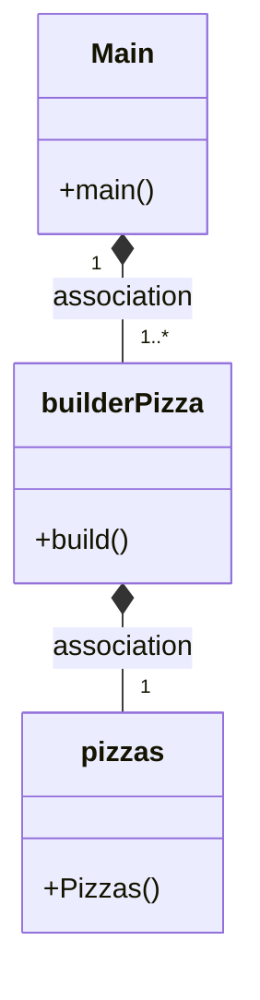
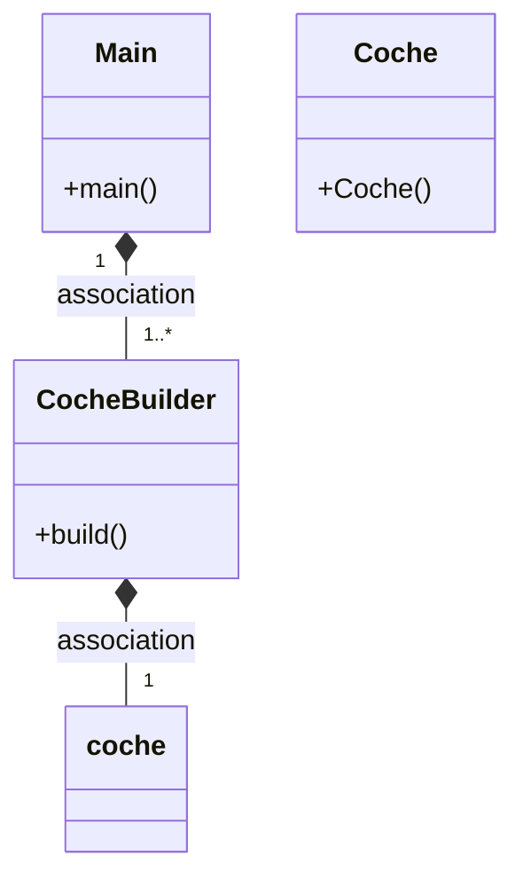

# Builder Pattern
## Preguntas Tarea
### ¿Cuál es la función de este patrón?
El patrón Builder en Java es un patrón de diseño que se utiliza para construir objetos complejos. Su función es separar la creación de un objeto de su representación, lo que permite que el mismo proceso de construcción pueda crear diferentes representaciones del objeto. La idea principal detrás del patrón Builder es proporcionar una interfaz clara y sencilla. En lugar de tener que lidiar con una gran cantidad de constructores y parámetros, proporciona un conjunto de métodos para configurar las propiedades del objeto a medida que se va construyendo. Esto hace que el proceso de construcción sea más intuitivo y fácil de usar.

### Diagrama



### ¿Podríamos combinarlo con el patrón Factory?

Sí, el patrón Builder se puede combinar con el patrón Factory para crear objetos complejos de forma más flexible y escalable. Una forma de combinar estos patrones es utilizando una clase Factory que crea objetos de una clase determinada utilizando un Builder interno para configurar las propiedades del objeto. De esta manera, se puede separar la creación del objeto de su construcción, lo que permite una mayor flexibilidad y escalabilidad en el proceso de creación.

## **************************************************************************************

## Preguntas Examen

### ¿Cual es la función del patrón builder? Pon ejemplo (que no sea Pizzas)

Copio y pego la respuesta de arriba en la tarea y tras eso pongo el ejemplo:

El patrón Builder en Java es un patrón de diseño que se utiliza para construir objetos complejos. Su función es separar la creación de un objeto de su representación, lo que permite que el mismo proceso de construcción pueda crear diferentes representaciones del objeto. La idea principal detrás del patrón Builder es proporcionar una interfaz clara y sencilla. En lugar de tener que lidiar con una gran cantidad de constructores y parámetros, proporciona un conjunto de métodos para configurar las propiedades del objeto a medida que se va construyendo. Esto hace que el proceso de construcción sea más intuitivo y fácil de usar.

Si quisieramos crear coches con diferente color o motor, habría que crear la clase Coche con dichos atributos, getters y setters... y luego creariamos CocheBuilder con su objeto Coche privado que se modifica con los getters&setters para devolver al final en el método Build.


### ¿Como es su Diagrama de clases de este ejemplo que has hecho? Realiza en el readme el diagrama



### ¿Podríamos combinarlo con el patrón Factory? Explica con algo de código como lo harías.

Dado que la explicación extendida está arriba en la tarea, copio y pego esa respuesta y voy a hacer un ejemplo con código. 
 


1.-En primer lugar, si quisieramos crear un objeto de tipo Coche con sus diferentes características, hay que crear una interfaz.

```

public interface CocheBuilder {
    public void buildModelo(String modelo);
    public void buildColor(String color);
    public void buildMotor(String motor);
    public Coche getCoche();
}

```

2.- Después creamos una clase que implemente la interfaz que hemos creado para ir construyendo el objeto.

```
public class CocheBuilderImpl implements CocheBuilder {
    private String modelo;
    private String color;
    private String motor;

    @Override
    public void buildModelo(String modelo) {
        this.modelo = modelo;
    }

    @Override
    public void buildColor(String color) {
        this.color = color;
    }

    @Override
    public void buildMotor(String motor) {
        this.motor = motor;
    }

    @Override
    public Coche getCoche() {
        return new Coche(modelo, color, motor);
    }
}

```

3.- Ahora creamos una Factory para crear las instancias de CocheBuilder.

```
public class CocheBuilderFactory {
    public static CocheBuilder crearCocheBuilder() {
        return new CocheBuilderImpl();
    }
}

```

4.- ¡Ahora ya podemos utilizar la combinación para construir nuestro coche!

```
CocheBuilder cocheBuilder = CocheBuilderFactory.createCocheBuilder();
cocheBuilder.buildModelo("Tesla Model 3");
cocheBuilder.buildColor("Rojo");
cocheBuilder.buildMotor("Eléctrico");
Coche coche = cocheBuilder.getCoche();
```


