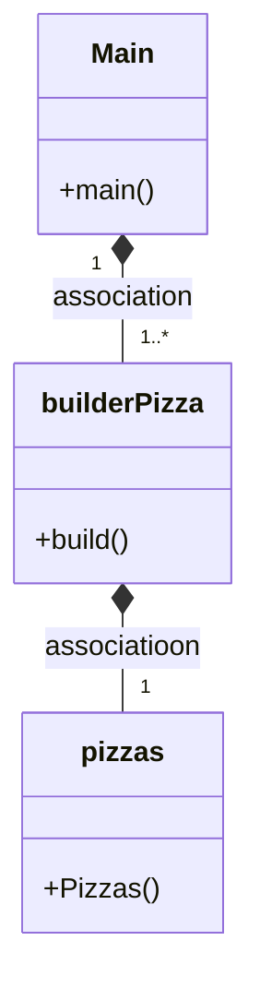

# Builder Pattern
## Preguntas Tarea
### ¿Cuál es la función de este patrón?
El patrón Builder en Java es un patrón de diseño creacional que se utiliza para construir objetos complejos. Su función es separar la creación de un objeto de su representación, lo que permite que el mismo proceso de construcción pueda crear diferentes representaciones del objeto.
La idea principal detrás del patrón Builder es proporcionar una interfaz clara y sencilla para la construcción de objetos complejos. En lugar de tener que lidiar con una gran cantidad de constructores y parámetros, el patrón Builder proporciona un conjunto de métodos para configurar las propiedades del objeto a medida que se va construyendo. Esto hace que el proceso de construcción sea más intuitivo y fácil de usar.

### Diagrama

### ¿Podríamos combinarlo con el patrón Factory?

Sí, el patrón Builder se puede combinar con el patrón Factory para crear objetos complejos de forma más flexible y escalable.
Una forma de combinar estos patrones es utilizando una clase Factory que crea objetos de una clase determinada utilizando un Builder interno para configurar las propiedades del objeto. De esta manera, se puede separar la creación del objeto de su construcción, lo que permite una mayor flexibilidad y escalabilidad en el proceso de creación.

